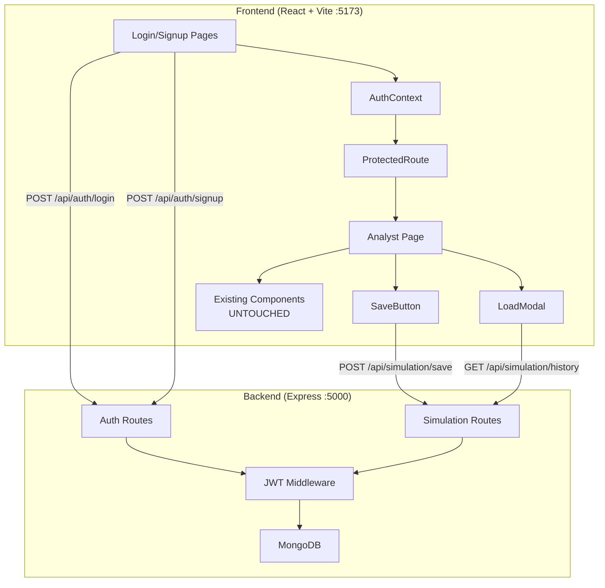

# ENVIRION: Backend + Authentication Walkthrough

## Summary

Successfully added **JWT authentication**, **MongoDB persistence**, and **simulation save/load** capabilities to the existing ENVIRION Digital Twin React application — with **zero changes** to any simulation logic, AQI calculations, MapLibre behavior, drag-and-drop, or marker systems.

---

## Architecture



---

## Files Created (15 new files)

### Backend — `server/`

| File | Purpose |
|------|---------|
| [package.json](file:///d:/C%20Data%20Backup/Users/victu/OneDrive/Desktop/New%20folder/server/package.json) | Express, Mongoose, bcryptjs, jsonwebtoken, cors, dotenv |
| [.env](file:///d:/C%20Data%20Backup/Users/victu/OneDrive/Desktop/New%20folder/server/.env) | MONGO_URI, JWT_SECRET, PORT |
| [index.js](file:///d:/C%20Data%20Backup/Users/victu/OneDrive/Desktop/New%20folder/server/index.js) | Express server, MongoDB connection, route mounting |
| [models/User.js](file:///d:/C%20Data%20Backup/Users/victu/OneDrive/Desktop/New%20folder/server/models/User.js) | User schema with bcrypt pre-save hook |
| [models/Simulation.js](file:///d:/C%20Data%20Backup/Users/victu/OneDrive/Desktop/New%20folder/server/models/Simulation.js) | Simulation schema (location, interventions, markers, results) |
| [middleware/auth.js](file:///d:/C%20Data%20Backup/Users/victu/OneDrive/Desktop/New%20folder/server/middleware/auth.js) | JWT verification middleware |
| [routes/auth.js](file:///d:/C%20Data%20Backup/Users/victu/OneDrive/Desktop/New%20folder/server/routes/auth.js) | Signup, Login, Get Me endpoints |
| [routes/simulation.js](file:///d:/C%20Data%20Backup/Users/victu/OneDrive/Desktop/New%20folder/server/routes/simulation.js) | Save, History, Get By ID endpoints |

### Frontend — New Files

| File | Purpose |
|------|---------|
| [AuthContext.jsx](file:///d:/C%20Data%20Backup/Users/victu/OneDrive/Desktop/New%20folder/react-app/src/context/AuthContext.jsx) | React Context for auth state, token management |
| [backend.js](file:///d:/C%20Data%20Backup/Users/victu/OneDrive/Desktop/New%20folder/react-app/src/services/backend.js) | Backend API calls (auth + simulation) |
| [Login.jsx](file:///d:/C%20Data%20Backup/Users/victu/OneDrive/Desktop/New%20folder/react-app/src/pages/Login.jsx) | Login page with government branding |
| [Signup.jsx](file:///d:/C%20Data%20Backup/Users/victu/OneDrive/Desktop/New%20folder/react-app/src/pages/Signup.jsx) | Registration page |
| [ProtectedRoute.jsx](file:///d:/C%20Data%20Backup/Users/victu/OneDrive/Desktop/New%20folder/react-app/src/components/ProtectedRoute.jsx) | Auth guard wrapper |
| [SaveButton.jsx](file:///d:/C%20Data%20Backup/Users/victu/OneDrive/Desktop/New%20folder/react-app/src/components/SaveButton.jsx) | Save simulation with status feedback |
| [LoadModal.jsx](file:///d:/C%20Data%20Backup/Users/victu/OneDrive/Desktop/New%20folder/react-app/src/components/LoadModal.jsx) | Load history modal with AQI badges |
| [auth.css](file:///d:/C%20Data%20Backup/Users/victu/OneDrive/Desktop/New%20folder/react-app/src/styles/auth.css) | Auth page styles |

---

## Files Modified (5 files — surgical additions only)

| File | Change |
|------|--------|
| [App.jsx](file:///d:/C%20Data%20Backup/Users/victu/OneDrive/Desktop/New%20folder/react-app/src/App.jsx) | Added AuthProvider, Login/Signup routes, ProtectedRoute |
| [Analyst.jsx](file:///d:/C%20Data%20Backup/Users/victu/OneDrive/Desktop/New%20folder/react-app/src/pages/Analyst.jsx) | Added handleSave/handleLoadSimulation + SaveButton/LoadModal rendering |
| [AnalystNav.jsx](file:///d:/C%20Data%20Backup/Users/victu/OneDrive/Desktop/New%20folder/react-app/src/components/AnalystNav.jsx) | Added user display, Save/Load/Logout buttons |
| [Navbar.jsx](file:///d:/C%20Data%20Backup/Users/victu/OneDrive/Desktop/New%20folder/react-app/src/components/Navbar.jsx) | Auth-aware: shows Sign In/Register or user+Logout |
| [vite.config.js](file:///d:/C%20Data%20Backup/Users/victu/OneDrive/Desktop/New%20folder/react-app/vite.config.js) | Added `/api` proxy to backend |

---

## Files NOT Modified (22 files protected)

All simulation logic, AQI calculations, MapLibre, CSS, and landing page components remain **100% untouched**:

`utils/aqi.js`, `utils/simulation.js`, `services/api.js`, `MapView.jsx`, `LeftPanel.jsx`, `RightPanel.jsx`, `HeatmapLegend.jsx`, `AqiScaleBox.jsx`, `AuditLogModal.jsx`, `Hero.jsx`, `HowItWorks.jsx`, `Features.jsx`, `About.jsx`, `CtaBanner.jsx`, `Footer.jsx`, `PartnersStrip.jsx`, `Home.jsx`, `shared.css`, `index.css`, `analyst.css`, `index.html`, `main.jsx`

---

## Verification Results

### API Endpoints ✅
- `POST /api/auth/signup` — Creates user, returns JWT ✅
- `POST /api/auth/login` — Authenticates user, returns JWT ✅
- `GET /api/auth/me` — Returns user profile (protected) ✅

### Login Page ✅


### Analyst Dashboard After Login ✅


**Confirmed working:**
- ✅ MapLibre satellite basemap with 3D buildings & heatmap
- ✅ Live AQI data from Open-Meteo (PM2.5: 47.1, AQI: 130)
- ✅ All 8 intervention strategies with sliders
- ✅ User display: "🏛️ Pune Municipal C..."
- ✅ Save button (green, nav bar + floating)
- ✅ Load button (blue, nav bar)
- ✅ Logout button
- ✅ All existing UI behavior unchanged

---

## How to Run

### Terminal 1 — Backend
```bash
cd server
npm run dev
```
Requires MongoDB running locally on `mongodb://localhost:27017`

### Terminal 2 — Frontend
```bash
cd react-app
npm run dev
```

Open http://localhost:5173 — the frontend proxies `/api` calls to the backend on port 5000.

### Test Credentials
```
Email: admin@pmc.gov.in
Password: test123456
```

---

## API Reference

| Method | Endpoint | Auth | Description |
|--------|----------|------|-------------|
| POST | `/api/auth/signup` | No | Register new municipality |
| POST | `/api/auth/login` | No | Login, returns JWT |
| GET | `/api/auth/me` | Bearer | Get current user |
| POST | `/api/simulation/save` | Bearer | Save simulation |
| GET | `/api/simulation/history` | Bearer | Get user's simulations |
| GET | `/api/simulation/:id` | Bearer | Get single simulation |
